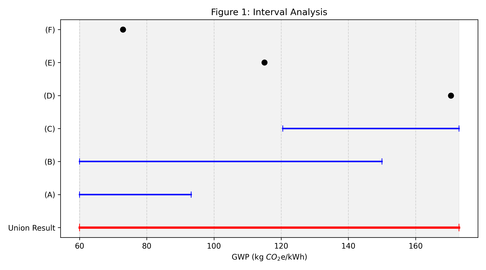
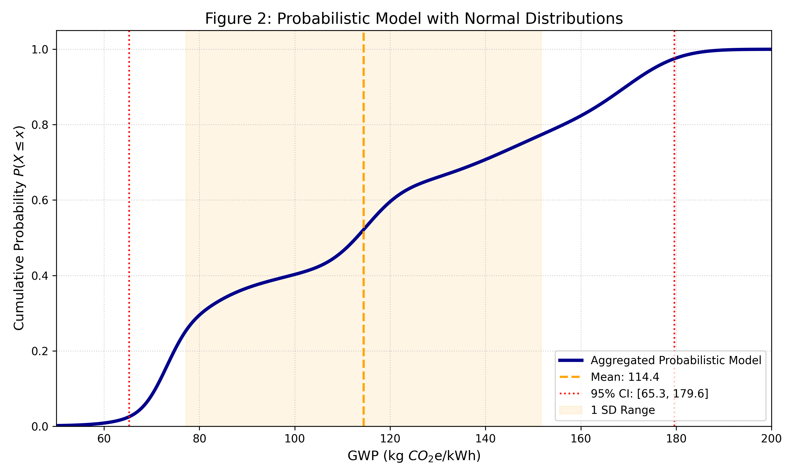
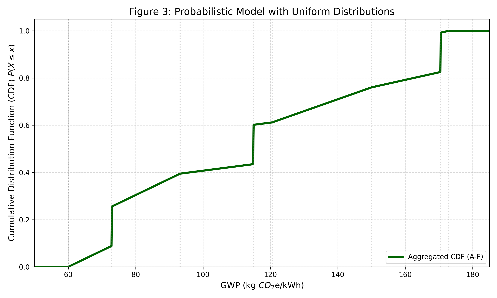
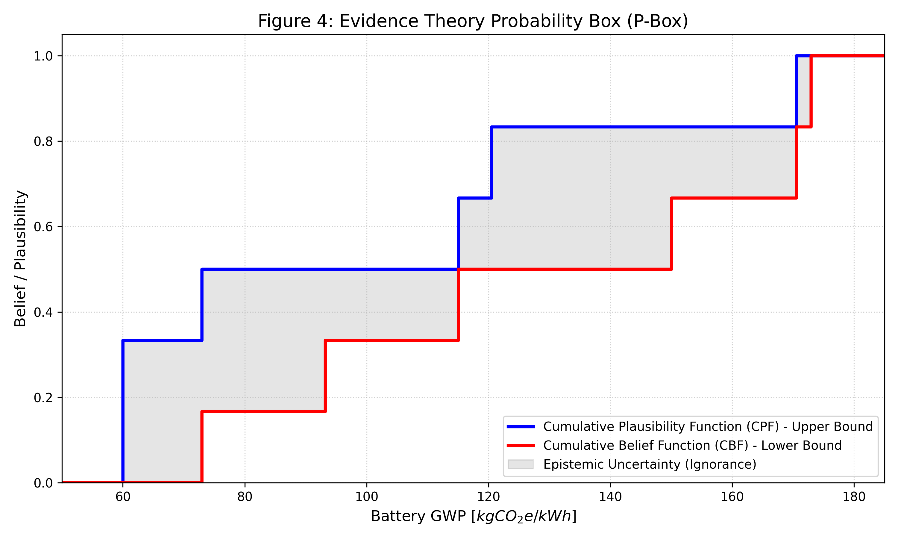

# Example for Uncertainty Modeling

A worked example showing how to transform sparse data into quantifiable uncertainty models for early-stage design decision-making.

## The data (example):

we assume to want to perform an early-stage conceptual design an electric vehilce system using lithium-ion battery (LIB) electric propulsion (electric ground vehicle, electric aircraft, electric maritime system etc.). For assesing the lifecycle battery energy specific Global Warming Potential (GWP) ($kg CO_2e/kWh$), that is the time scaled (on 100 years) global warming potential per energy unit (kWh) of the specifc energy the battery we use. We do an intial literature review and find following values:

| GWP ($kg CO_2e / kWh$) | Value           | Source                     |
|------------------------|-----------------|----------------------------|
| 60-93.2                | Range           | (A) Abdelbaky et al.[^A]   |
| 60-150                 | Range           | (B) Amarakoon et al.[^B]   |
| 120.5-172.9            | Range           | (C) André & Hajek[^C]      |
| 170.5                  | Scalar          | (D) Liberacki et al.[^D]    |
| 115                    | Scalar          | (E) Pollet et al.[^E]       |
| 72.9                   | Scalar          | (F) Pontika et al.[^F]      |

As we have multiple sources with different reported values, we are confronted with *epsitemic* uncertainty, categorized as a lack of knowledge. As the real world lifecycle battery energy specific GWP of our future battery system in-use will have a fix value, it is not inherent variable (aletory uncertainty).

In the following, we present three simple ways to quantify the reported values into an uncertainty metrics, that can be further utilized within an decision making process (design, lifecycle assessement, etc.). 

## Interval Analysis 

Interval analysis is the most basic way to handle "non-stochastic" uncertainty. It assumes we know the limits of a value but have zero knowledge of the distribution within those limits. We simply know our data ranges from a minimum to a maximum, but have no information on its inherent cummulation. 

We treat every data point as set $X = [a, b]$. For a single value like 170.5, the interval is simply [170.5, 170.5]. 
We take the union of all sets $(min(all $X$), max(all $X$))$ to define the interval of our data. 

$GWP_{bat_{min}}$ = min(all X) = 60.0 $kg CO_2e/kWh$
$GWP_{bat_{max}}$ = max(all X) = 172.9 $kg CO_2e/kWh$

Resulting in [60.0, 172.9] $kg CO_2e/kWh$ and illustrated in Figure 1. 

Interval anaylsis provides a safety envelope and provides a robust tool when adding no assumptions itself introducing new uncertainty. However it is pessimistic as it ignores the fact that data points might cluster wihtin specifc ranges.

## Probability Theory

While Interval Analysis provides the absolute boundaries of our data, it treats all values within those boundaries as equally unknown. However, in decision-making we often assume that there is a central tendency, meaning the true value is more likely to be near the average of reported values than at the extreme edges. To model this, we can use Probability Theory. We discuss two approaches to handle uncertainty with probability theory.

### Normal Distribution

Since we are dealing with sparse literature data, we treat each source as a separate probability distribution and aggregate them into a single Mixture Model. In this approach, we make the following assumptions for each literature source $i$:

The Mean ($\mu_i$): We asume the most likely value is the center of the reported range. For scalars the mean is the value itsled:

$$
\mu_i = \frac{Low_i + High_i}{2}
$$

The Standard Deviation ($\sigma_i$): We assume the reported range represent a 95% confidence interval. In a Normal distribution, 95% of the data falls within $\pm 1.96$ standard deviations of the mean.

$$
\sigma_i = \frac{High_i - Low_i}{2 \times 1.96}
$$

For scalar values $(D, E, F)$ we assume a small 5% coefficient of variation to account for inherent measurement error.

We combine all $n$ sources by averaging their **Cumulative Distribution Functions (CDFs)**.  
This gives every study an equal **vote** $(1/n)$ in the final model.

$$
P(X \le x) = \frac{1}{n} \sum_{i=1}^{n} \Phi\left(\frac{x - \mu_i}{\sigma_i}\right)
$$

Where $\Phi$ is the **standard normal CDF**.

Using the provided Python script (probability_analysis_normal.py), we derive the following statistical model for the Battery GWP (Figure 2):

The "consensus" average of all literature.
$$
\mu_{normal} = 114.45 $kg CO_2e/kWh$ 
$$

A measure of how much the studies disagree.
$$
\sigma_{uniform} = 37.25 $kg CO_2e/kWh$
$$

The optimistic boundary (2.5% quantile)
$$
95\% CI lower = 65.26 $kg CO_2e/kWh$
$$

The conservative boundary (97.5% quantile).
$$
95\% CI upper = 179.61 $kg CO_2e/kWh$
$$

A large Standard Deviation (like the ~33% relative SD we see here) is a quantitative signal of high epistemic uncertainty. It tells the designer that the literature is significantly divided on the true GWP of the battery system.

### Uniform Distribution 

While the Normal distribution assumes a central tendency (that the middle of a range is more likely), the Uniform Distribution is more conservative. It assumes that for any given study, every value within the reported range is equally likely. This approach is often preferred when we have no evidence to suggest the true value is in the center of a range rather than at the boundaries.

For each range [a,b], the Cumulative Distribution Function (CDF) is a linear ramp:

$$
F(x) = \frac{x-a}{b-a} for a \le x \le b
$$

For scalar values $(D, E, F)$, the CDF is a discrete step function (a jump from 0 to 1 at that exact value).  
Like the Normal approach, we aggregate these by giving each study a $1/n$ weight:

$$
P(X \le x) = \frac{1}{n}\sum_{i=1}^{n} F_i(x)
$$

Using the provided Python script (probability_analysis_uniform.py), we derive the following statistical model (Figure 3):

Mean ($\mu_{uniform}$): 114.45 $kg CO_2e/kWh$
Standard Deviation ($\sigma_{uniform}$): 37.47 $kg CO_2e/kWh$
95% CI Lower (2.5%): 63.64 $kg CO_2e/kWh$
95% CI Upper (97.5%): 170.53 $kg CO_2e/kWh$

While the Normal distribution creates smooth S-curves, the Uniform distribution results in a piecewise linear CDF. The curve is composed of two distinct geometric features that correspond directly to our data: The linear ramps represent the ranges (sources A, B, C), with constant rate of cummulating probability across those intervals. The verticla steps represent the scalars (sources D, E, F), where each jump indicates a "point of agreement", where 1/6 (16.6%) of the total probability is concentrated at a single, precise value.  

## Evidence Theory (Dempster-Shafer (D-S) Theory)

While Probability Theory forces us to distribute likelihood across a range (even if we don't know the shape), Evidence Theory (also called Dempster-Shafer theory) allows us to measure uncertainty through Belief and Plausibility.

In this model, we assign a Basic Belief Assignment (BBA), denoted as $m$, to each piece of evidence. If we trust our 6 sources equally, each receives a mass of $m=1/6$.

- Cumulative Belief Function (CBF - Red): This is the conservative lower bound. For a given value x, the CBF only increases if a study's entire range is below x. The Belief (Bel) (the lower bound) represents the total evidence that strictly supports a proposition. For a GWP value x, Bel(x) is the sum of masses where the entire reported interval is below x. It is our "guaranteed" certainty.
 
  $$
  CBF(x) = \sum_{B \subseteq (-\infty, x]} m(B)
  $$

- Cumulative Plausibility Function (CPF - Blue): This is the optimistic upper bound. It represents the evidence that could be true. For a given value x, the CPF increases if even just the lowest point of a study's range is below x. The Plausibility (Pl) (the upper bound) represents the total evidence that could be true (i.e., not yet ruled out). For a GWP value x, Pl(x) is the sum of masses where at least part of the reported interval is below x.

  $$
  CPF(x) = \sum_{B \cap (-\infty, x] \neq \emptyset} m(B)
  $$

Instead of a single CDF curve, Evidence Theory produces two bounding curves that create a Probability Box (P-Box), illustrating how belief and plausibility define a probability interval as lower and upper bounds. Using the provided Python script (evidence_theory.py), we visualize the literature data (Figure 4):

The gray shaded area between the Blue (Plausibility) and Red (Belief) lines is a direct measurement of our lack of knowledge (ignorance). Where the lines are far apart (e.g., between 90 and 120), the literature is either vague or conflicting. Where they pinch together (e.g., at the scalar points), our certainty is higher because the sources provided precise values. A risk-averse designer would look at the Belief curve (Red) to see what can be proven, while a risk-tolerant designer might look at the Plausibility curve (Blue) to see what is possible.

We notice that at approximately 115 $kg CO_2e/kWh$, the Cumulative Belief Function (CBF) and Cumulative Plausibility Function (CPF) converge, momentarily eliminating the "Area of Ignorance." This indicates a point of consensus across the disparate literature sources. At this specific threshold, there is no ambiguity: exactly 50% of the evidence supports a GWP of 115 or lower. This is largely driven by the presence of Source E (Pollet et al.), which provides a precise scalar value of 115, effectively anchoring the probability box and providing a moment of certainty amidst the surrounding epistemic gaps. Assume presenting this to a stakeholder, we can point to 115 as your most robust estimate. Unlike other values where we are "guessing" within a gray zone of ignorance, 115 is the value where our conservative evidence (Belief) and our optimistic potential (Plausibility) perfectly align.

In Evidence Theory, we don't get a single mean or standard deviation like we do in Probability Theory because the theory is designed to avoid making a single guess. Instead of a single number, we get an interval of possible means, known as the Lower Expected Value ($E_{low}) (calculated using the Belief curve) and Upper Expected Value $E_{high} (calculated using the Plausibility curve). 

For your specific dataset it is the interval [99.82, 129.08]. This tells the decision-maker: "Based on the evidence, the average GWP is somewhere in this range, and our ignorance prevents us from being more precise."

## References

[^1]: The theoretical framework for uncertainty modeling in this work is based on: Wen Yao, Xiaoqian Chen, Wencai Luo, Michel Van Tooren, and Jian Guo. *Review of uncertainty-based multidisciplinary design optimization methods for aerospace vehicles*. Progress in Aerospace Sciences, 47(6):450–479, August 2011.

[^A]: Mohammad Abdelbaky, Lilian Schwich, João Henriques, Bernd Friedrich, Jef R. Peeters, and Wim Dewulf. *Global warming potential of lithium-ion battery cell production: Determining influential primary and secondary raw material supply routes*. Cleaner Logistics and Supply Chain, 9:100130, December 2023.

[^B]: Shanika Amarakoon, Jay Smith, and Brian Segal. *Application of Life-Cycle Assessment to Nanoscale Technology: Lithium-ion Batteries for Electric Vehicles*, April 2013.

[^C]: Nicolas André and Manfred Hajek. *Robust Environmental Life Cycle Assessment of Electric VTOL Concepts for Urban Air Mobility*. In AIAA Aviation 2019 Forum, Dallas, Texas, June 2019. American Institute of Aeronautics and Astronautics.

[^D]: Adam Liberacki, Barbara Trincone, Gabriella Duca, Luigi Aldieri, Concetto Paolo Vinci, and Fabio Carlucci. *The Environmental Life Cycle Costs (ELCC) of Urban Air Mobility (UAM) as an input for sustainable urban mobility*. Journal of Cleaner Production, 389:136009, February 2023.

[^E]: Félix Pollet, Florent Lutz, Thomas Planès, Scott Delbecq, and Marc Budinger. *A generic life cycle assessment tool for overall aircraft design*. Applied Energy, 399:126514, December 2025.

[^F]: Evangelia Pontika, Panagiotis Laskaridis, and Phillip J. Ansell. *Technology exploration of zero-emission regional aircraft: Why, what, when and how?* August 2025.